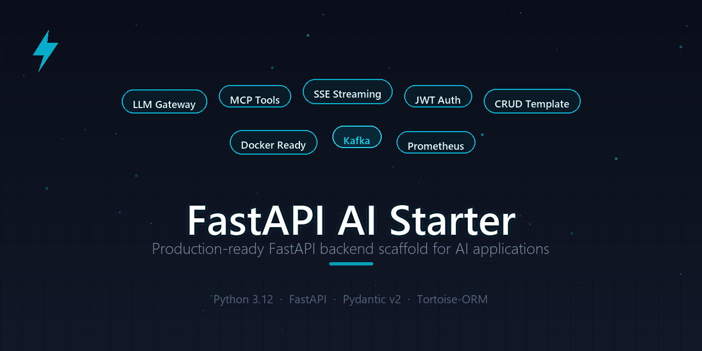

# FastAPI AI Starter

[](https://www.python.org/downloads/release/python-3120/)
[](https://fastapi.tiangolo.com/)
[](https://docs.pydantic.dev/)
[](#4-容器化部署)
[](./.github/workflows/ci.yml)
[](#-测试覆盖)
[](./LICENSE)

<p align="center">
  
</p>

## 一句话介绍

**面向 AI 应用的生产级 FastAPI 后端脚手架** —— 用户鉴权 / 资源 CRUD / LLM 多模型网关 / MCP 工具 / SSE 流式 / 消息队列 / 任务调度 / 可观测性，全部开箱即用。3 分钟启动，直接写业务。

> 从零搭一个 AI 应用后端要多久？注册登录、权限、分页、流式输出、模型接入、健康检查……
> 用 fastapi-ai-starter，这些都有了，你只需要写业务逻辑。

---

## 为什么选 fastapi-ai-starter？

市面上 FastAPI 脚手架很多，但它们大多是 **通用 CRUD 模板**。做 AI 应用时，你还得自己接 LLM、搞流式、搭工具生态。

| 能力 | fastapi-ai-starter | fastapi 官方模板 | full-stack-fastapi | 其他 boilerplate |
|---|:---:|:---:|:---:|:---:|
| 用户体系（注册/登录/角色） | ✅ | ❌ | ✅ | ⚠️ |
| 资源 CRUD + 权限隔离 | ✅ | ❌ | ⚠️ | ⚠️ |
| **LLM 多模型网关（零 SDK）** | ✅ | ❌ | ❌ | ❌ |
| **MCP 工具生态（SSE / stdio）** | ✅ | ❌ | ❌ | ❌ |
| **SSE 流式响应 + LLM Streamer** | ✅ | ❌ | ❌ | ⚠️ |
| Kafka 消息链路（自动重连） | ✅ | ❌ | ❌ | ❌ |
| 后台任务调度 + 实时进度 | ✅ | ❌ | ✅ | ⚠️ |
| 健康探针 + Prometheus 指标 | ✅ | ❌ | ⚠️ | ❌ |
| 限流 + 安全中间件 | ✅ | ❌ | ✅ | ⚠️ |
| Docker 多阶段 + CI/CD | ✅ | ❌ | ✅ | ⚠️ |
| DB 不可用优雅降级 | ✅ | ❌ | ❌ | ❌ |

**一句话差异**：别人给你一个 CRUD 架子，我们给你一个 **AI 应用直接能上生产** 的完整后端。

---

## 核心能力

| 模块 | 能力 | 演示端点 |
|---|---|---|
| 🔀 **LLM 多模型网关** | 多 provider 优先级降级、指数退避重试、Token / 成本统计、OpenAI / DeepSeek / Claude / Ollama 统一接口（chat / stream / embeddings） | `POST /llm/chat` |
| 🔧 **MCP 工具生态** | 工具注册中心 + JSON-RPC Server（SSE / stdio 双传输），直接接入 Claude Desktop、Cline 等 AI 客户端 | `GET /mcp/sse` |
| 🌊 **SSE 流式响应** | SSEStream（队列 / 生成器模式）、LLMStreamer（OpenAI 兼容流式输出） | `GET /sse/chat` |
| 📚 **RAG 知识库** | 文档入库自动分块 + embedding、内存向量索引（余弦相似度）、检索增强问答（普通 + SSE 流式）、无 LLM 时伪向量降级可离线 demo | `POST /rag/docs`、`POST /rag/search`、`POST /rag/chat` |
| 📨 **Kafka 消息链路** | 自动重连 + 自动建 topic 的 producer/consumer、EventPublisher 事件发布封装、回调式后台消费 worker | `POST /kafka/publish`、`GET /kafka/status` |
| ⏰ **后台任务调度** | TaskManager 注册中心（interval/cron）、手动触发 + 状态跟踪、SSE 实时进度订阅、暂停/恢复 | `GET /tasks`、`POST /tasks/{name}/trigger` |
| 📊 **可观测性** | DB / Redis / Kafka / LLM 四类健康探针、Prometheus 指标（P50-P99 延迟 / Token / 成本）、trace_id 结构化追踪 | `/monitor/healthz`、`/monitor/readyz`、`/monitor/metrics` |
| 🔐 **安全与限流** | 零依赖 HS256 JWT、API Key 鉴权（角色校验）、Redis Lua 滑动窗口限流（内存兜底）、请求 ID 链路 | `POST /security/token`、`GET /security/limited` |
| 👤 **用户体系** | PBKDF2-SHA256 密码哈希、注册/登录/改密、JWT Bearer 鉴权、admin/user 角色控制、DB 不可用优雅降级 | `POST /user/register`、`POST /user/login`、`GET /user/me`、`GET /user/list` |
| 📦 **资源 CRUD** | 统一分页/过滤/排序规范、owner 权限隔离（越权 404 防枚举）、管理员全量查询、部分更新、DB 降级 | `GET/POST/PUT/DELETE /resource/beams`、`GET /resource/admin/beams` |
| 🚀 **DevOps** | 多阶段 Dockerfile、docker-compose 一键编排（MySQL + Redis + 可选 Kafka）、GitHub Actions 自动回归 | `docker compose up -d` |

所有端点自带 Swagger 文档（`/docs`），80 项单元测试全量覆盖，CI 每次 push 自动回归。

## 0 快速上手

### ⚡ 30 秒极速体验（Docker）

一条命令启动整个后端，零配置：

```shell
docker compose up -d
```

启动后你可以：

| 你想看什么 | 访问地址 |
|---|---|
| 📖 **完整 API 文档**（Swagger UI） | `http://localhost:8080/api/sample/docs` |
| 📋 **Redoc 文档** | `http://localhost:8080/api/sample/redoc` |
| ❤️ 存活检查 | `http://localhost:8080/api/sample/monitor/healthz` |
| ✅ 就绪探针（各组件状态） | `http://localhost:8080/api/sample/monitor/readyz` |
| 📊 Prometheus 指标 | `http://localhost:8080/api/sample/monitor/metrics` |

> 想加 Kafka？`docker compose --profile full up -d` 即可。
>
> 首次启动会自动建表（compose 已开启 `FS_AUTO_SCHEMA=true`，safe 模式不破坏已有数据），注册登录可直接体验。

### 💻 本地开发

```powershell
# 1. 创建并激活 3.12 虚拟环境
py -3.12 -m venv .venv
.\.venv\Scripts\Activate.ps1

# 2. 安装依赖（含开发工具：aerich/ruff/pytest）
pip install -e ".[dev]"

# 3. 修改 project_env 中的数据库地址 / 账号 / 密码

# 4. 启动（typer 命令）
python main.py run            # 默认监听 0.0.0.0:8080
python main.py run --reload   # 开发热重载
```

启动后访问：
- Swagger UI: `http://127.0.0.1:8080/api/sample/docs`
- ReDoc: `http://127.0.0.1:8080/api/sample/redoc`
- 健康检查: `http://127.0.0.1:8080/api/sample/monitor/healthz`

### 主要技术栈

| 领域 | 选型 |
|---|---|
| 运行时 | **Python 3.12**（`asyncio.timeout`、`tomllib` 内置） |
| Web 框架 | FastAPI ≥ 0.115（`lifespan` 管理） |
| 序列化 | **Pydantic v2** + pydantic-settings |
| ORM | tortoise-orm[asyncmy] ≥ 0.21 + aerich 迁移 |
| 缓存 | redis ≥ 5.1（`redis.asyncio`，单连接 / 哨兵双模式） |
| 消息 | aiokafka ≥ 0.11 |
| 调度 | apscheduler ≥ 3.10（lifespan 托管） |
| LLM | httpx 直连（零 SDK 依赖，OpenAI 兼容协议） |

## 1 项目结构

```
├── main.py                 # Typer CLI 入口（run / mcp 两个命令）
├── setup.py                # cx_Freeze 编译脚本（可选的预编译发布）
├── project_env             # 环境变量文件（数据库等连接配置）
├── pyproject.toml          # 项目配置（依赖 / ruff / aerich / [myproject] 运行时配置）
├── requirements.txt        # 依赖清单（Docker / CI 构建用）
├── Dockerfile              # 多阶段构建（venv 依赖层 + slim 运行层）
├── docker-compose.yml      # app + MySQL + Redis（--profile full 加 Kafka）
├── .github/workflows/      # GitHub Actions（ruff lint + 单元测试）
├── migrations/             # aerich 迁移文件
└── src/
    ├── application.py      # Typer 命令行入口
    ├── settings.py         # pydantic-settings 配置层（环境变量 > project_env > pyproject）
    ├── faster/             # FastAPI 应用层
    │   ├── apps.py         # FastAPI 实例 + 中间件挂载
    │   ├── events.py       # lifespan：Tortoise → Redis → Scheduler → LLM 网关
    │   ├── middlewares/    # 请求 ID + 访问日志中间件
    │   └── routers/        # 路由（users / resource / mcp / sse / llm / rag / monitor / security）
    └── my_tools/           # 独立工具库（可单独复用）
        ├── llm_tools/      # LLM 网关（多 provider 降级 / 重试 / 成本统计 / embeddings）
        ├── mcp_tools/      # MCP 协议（注册中心 / JSON-RPC Server / SSE+stdio 传输）
        ├── sse_tools/      # SSE 流式（SSEStream / LLMStreamer）
        ├── rag_tools/      # RAG（分块 / 伪向量降级 / 内存索引 / 检索问答编排）
        ├── observability/  # 可观测（健康探针 / Prometheus 指标 / 调用追踪）
        ├── security_tools/ # 安全（JWT / API Key / 滑动窗口限流）
        ├── redis_tools/    # redis.asyncio 客户端（单连接 / 哨兵，自动重连）
        ├── kafka_tools/    # aiokafka 客户端
        ├── schedule_tasks/ # 后台任务管理（TaskManager / 示例任务）
        ├── fastapi_tools/  # CBV 装饰器与视图集
        ├── tortoise_tools/ # Tortoise 自定义字段、验证器
        └── schedule_tasks/ # 定时任务函数
```

- **settings.py**：基于 `pydantic-settings` 加载 `project_env` + `pyproject.toml.[myproject]`，环境变量优先，容器部署时零改动注入配置。
- **faster.events**：`@asynccontextmanager` lifespan，启动按序初始化资源并挂到 `app.state`，路由通过 `request.app.state.redis` 取用；未配置的能力（如空数据库 apps）自动跳过。
- **my_tools.\***：所有工具模块零 FastAPI 耦合（除 auth / rate_limit 的依赖封装），可独立复制到其他项目复用。

## 2 配置说明

运行时配置集中在 `pyproject.toml` 的 `[myproject]` 段，优先级：**环境变量 > project_env > pyproject.toml > 默认值**。

常用环境变量（容器部署）：

| 变量 | 说明 |
|---|---|
| `FASTSAMPLE_DATABASE_HOST/PORT/USER/PASSWORD/NAME` | MySQL 连接 |
| `FS_REDIS_HOST/PORT` | Redis 地址 |
| `FS_REDIS_SENTINEL_SERVICE` | 哨兵地址列表；设为 `none` 走单连接模式 |
| `FS_KAFKA_SERVICE` | Kafka bootstrap servers |
| `FS_KAFKA_ENABLED` | 设为 `true` 启用 Kafka 链路（默认关闭） |

LLM 提供商在 `[myproject.llm.providers]` 配置（DeepSeek / OpenAI / Anthropic / Ollama 等 OpenAI 兼容接口），API Key 建议通过环境变量注入后写入。

Kafka 链路默认关闭，启用方式（二选一）：`[myproject.mq] enabled = true` 或环境变量 `FS_KAFKA_ENABLED=true`。启用后 lifespan 自动挂载 producer（自动重连 + 自动建 topic）、启动回调式后台消费 worker，并纳入 `/monitor/readyz` 探针；通过 `POST /kafka/publish` 发布消息、`GET /kafka/status` 查看链路状态。消费回调继承 `BaseTopicCallSingle` 并在 `my_tools/kafka_tools/examples.py` 的 `get_consumer_callbacks()` 中注册即可。

安全配置见 `[myproject.security]`（API Key 表 / JWT 密钥 / 限流参数）——**生产环境务必修改默认 jwt_secret**。

### 2.5 用户体系

基于 Tortoise ORM + JWT Bearer 的完整用户体系，代码位于 `src/faster/routers/users/`。

| 端点 | 方法 | 鉴权 | 说明 |
|---|---|---|---|
| `/user/register` | POST | 无 | 注册新用户（用户名 3-32 位字母数字下划线，密码 ≥ 8 位） |
| `/user/login` | POST | 无 | 登录签发 JWT（access_token / token_type / expires_in） |
| `/user/me` | GET | Bearer JWT | 获取当前用户信息（不含密码哈希） |
| `/user/password` | PUT | Bearer JWT | 修改自己的密码（需旧密码验证） |
| `/user/list` | GET | Bearer JWT (admin) | 分页用户列表（仅 admin 角色） |

**核心特性：**
- **PBKDF2-SHA256 密码哈希**：100,000 次迭代 + 16 字节随机盐，存储格式 `pbkdf2_sha256$iterations$salt$hash`，常量时间比较防时序攻击（stdlib 零依赖实现）
- **JWT 角色鉴权**：Token 携带 `sub`（用户名）、`role`（user/admin）、`uid`（用户ID），通过 `require_jwt_role("admin")` 依赖限制管理端点
- **DB 不可用优雅降级**：数据库连接失败时应用照常启动，用户相关端点统一返回 503，不影响其他模块
- **字段零泄露**：所有对外响应模型均不包含 `password_hash` 字段

**快速试用：**

> 以下为 bash 语法，Windows 用户请使用 Git Bash / WSL 执行，或在 Swagger 文档页直接点击调试。

```shell
# 注册
curl -X POST http://localhost:8080/api/sample/user/register \
  -H "Content-Type: application/json" \
  -d '{"username":"alice","password":"mysecret123","password_again":"mysecret123"}'

# 登录获取 token
TOKEN=$(curl -s -X POST http://localhost:8080/api/sample/user/login \
  -H "Content-Type: application/json" \
  -d '{"username":"alice","password":"mysecret123"}' | python3 -c "import sys,json;print(json.load(sys.stdin)['access_token'])")

# 获取个人信息
curl http://localhost:8080/api/sample/user/me \
  -H "Authorization: Bearer $TOKEN"

# 修改密码
curl -X PUT http://localhost:8080/api/sample/user/password \
  -H "Authorization: Bearer $TOKEN" \
  -H "Content-Type: application/json" \
  -d '{"old_password":"mysecret123","new_password":"newsecret456"}'
```

> 管理员账号需手动在数据库中将 `role` 字段改为 `admin` 后访问 `/user/list`。

### 2.6 资源 CRUD 模板

基于 Beam 模型的标准 CRUD 模板，代码位于 `src/faster/routers/resource/`，可作为新业务模块的参考样板。

| 端点 | 方法 | 鉴权 | 说明 |
|---|---|---|---|
| `/resource/beams` | GET | Bearer JWT | 分页查询自己的波束（支持类型过滤 / 名称模糊 / 排序） |
| `/resource/beams/{id}` | GET | Bearer JWT | 获取单个波束详情（越权返回 404，防枚举） |
| `/resource/beams` | POST | Bearer JWT | 创建波束（自动绑定 owner 为当前用户） |
| `/resource/beams/{id}` | PUT | Bearer JWT | 部分更新波束（仅改传入字段） |
| `/resource/beams/{id}` | DELETE | Bearer JWT | 删除波束（204 无返回体） |
| `/resource/admin/beams` | GET | Bearer JWT (admin) | 管理员全量查询（支持 owner_id 过滤） |

**核心设计：**
- **统一分页工具**：`src/my_tools/tortoise_tools/pagination.py` 提供 `PageResult[T]` / `PaginationParams` / `OrderByParams` / `make_order_by_params()`，所有列表接口复用同一套规范
- **Owner 权限隔离**：普通用户的所有查询自动加 `owner_id=当前用户` 过滤，越权访问统一返回 404（避免资源 ID 枚举探测）
- **管理员全量视角**：`/resource/admin/beams` 需 admin 角色，支持按 `owner_id` 过滤指定用户的资源
- **部分更新**：PUT 接口使用 `model_dump(exclude_unset=True)`，只更新请求中显式传入的字段
- **DB 优雅降级**：所有 ORM 调用走 `_safe()` 包装，DB 不可用统一返回 503，不影响其他模块

**快速试用：**

```shell
# 登录获取 token
TOKEN=$(curl -s -X POST http://localhost:8080/api/sample/user/login \
  -H "Content-Type: application/json" \
  -d '{"username":"alice","password":"mysecret123"}' | python3 -c "import sys,json;print(json.load(sys.stdin)['access_token'])")

# 创建波束
curl -X POST http://localhost:8080/api/sample/resource/beams \
  -H "Authorization: Bearer $TOKEN" \
  -H "Content-Type: application/json" \
  -d '{"name":"beam-01","type":1}'

# 分页查询（类型过滤 + 排序）
curl "http://localhost:8080/api/sample/resource/beams?page=1&page_size=10&beam_type=1&sort=-created_at" \
  -H "Authorization: Bearer $TOKEN"

# 更新（仅改名称）
curl -X PUT http://localhost:8080/api/sample/resource/beams/1 \
  -H "Authorization: Bearer $TOKEN" \
  -H "Content-Type: application/json" \
  -d '{"name":"new-name"}'

# 删除
curl -X DELETE http://localhost:8080/api/sample/resource/beams/1 \
  -H "Authorization: Bearer $TOKEN"
```

> 新增业务模块时，复制 `resource/` 目录，替换 Model / Schema / 路由前缀即可，分页工具与 `_safe()` 降级模式直接复用。

### 2.7 RAG 知识库

基于 LLM 网关的向量检索 + LLM 问答示例，代码位于 `src/faster/routers/rag/`（业务层）和 `src/my_tools/rag_tools/`（可复用工具层）。**零新增依赖**，默认纯 Python 余弦相似度 + 内存向量索引；未配置 embedding provider 时自动降级为确定性哈希伪向量（保证离线 demo 可跑）。

| 端点 | 方法 | 鉴权 | 说明 |
|---|---|---|---|
| `/rag/docs` | GET | Bearer JWT | 分页查询自己的知识库文档（支持标题模糊、启用状态过滤） |
| `/rag/docs/{id}` | GET | Bearer JWT | 文档详情（含正文，越权 404） |
| `/rag/docs` | POST | Bearer JWT | 上传文档：自动分块 → embedding → 入库（DB + 内存索引） |
| `/rag/docs/{id}` | PUT | Bearer JWT | 更新文档（内容变更会重新分块+向量化） |
| `/rag/docs/{id}` | DELETE | Bearer JWT | 删除文档及所有分块 |
| `/rag/search` | POST | Bearer JWT | 纯向量检索（无 LLM 也能工作，降级伪向量） |
| `/rag/chat` | POST | Bearer JWT | 知识库问答：`stream=false` 返回完整 JSON，`stream=true` 返回 SSE 流式 |
| `/rag/stats` | GET | Bearer JWT | 模块统计（文档/分块/索引大小/LLM 状态/是否降级） |
| `/rag/admin/docs` | GET | Bearer JWT (admin) | 管理员全量文档列表 |

**核心设计：**
- **三层解耦**：`EmbeddingService`（embedding 门面，自动降级伪向量）→ `VectorStore` 抽象 + `InMemoryVectorStore`（纯 Python 余弦相似度，万级 chunk 以内）→ `RagService`（编排：分块 → 入库 → 检索 → 拼装 prompt → LLM 调用）
- **可扩展点**：`VectorStore` 是抽象基类，生产替换为 Milvus / PGVector / FAISS 只需实现 `add/delete/search` 四个方法；`RagServiceConfig` 支持在 `[myproject.rag]` 配 chunk 大小、top-k、embedding/chat 模型选择
- **SSE 流式输出**：`POST /rag/chat` 传 `"stream": true` 时，事件流会依次发出 `retrieval`（检索命中）→ 多个 `delta`（LLM 文本增量）→ `done`（结束元数据）→ 异常时发 `error`
- **权限隔离**：普通用户只能检索自己的文档；admin 可跨用户检索
- **启动预热**：lifespan 启动时从 MySQL 加载所有 chunk 重建内存索引（失败降级不影响服务启动）
- **优雅降级**：未配置任何 LLM provider 时，`/rag/search` 仍可用伪向量工作；`/rag/chat` 返回 503（与 `/llm/chat` 保持一致）

**快速试用：**

```shell
# 1. 登录（复用用户体系）
TOKEN=$(curl -s -X POST http://localhost:8080/api/sample/user/login \
  -H "Content-Type: application/json" \
  -d '{"username":"alice","password":"mysecret123"}' | python3 -c "import sys,json;print(json.load(sys.stdin)['access_token'])")

# 2. 上传文档（自动分块+向量化）
curl -X POST http://localhost:8080/api/sample/rag/docs \
  -H "Authorization: Bearer $TOKEN" \
  -H "Content-Type: application/json" \
  -d '{"title":"Python入门","content":"Python 是一种高级编程语言...","source":"demo"}'

# 3. 向量检索（无 LLM 也能跑，伪向量模式可用）
curl -X POST http://localhost:8080/api/sample/rag/search \
  -H "Authorization: Bearer $TOKEN" \
  -H "Content-Type: application/json" \
  -d '{"query":"什么是 Python","top_k":3}'

# 4. 知识库问答（需先在 [myproject.llm.providers] 配置 provider）
curl -X POST http://localhost:8080/api/sample/rag/chat \
  -H "Authorization: Bearer $TOKEN" \
  -H "Content-Type: application/json" \
  -d '{"query":"什么是 Python","stream":false}'

# 5. 流式问答（SSE）
curl -N -X POST http://localhost:8080/api/sample/rag/chat \
  -H "Authorization: Bearer $TOKEN" \
  -H "Content-Type: application/json" \
  -H "Accept: text/event-stream" \
  -d '{"query":"什么是 Python","stream":true}'
```

配置项见 `pyproject.toml [myproject.rag]`（chunk_size / chunk_overlap / default_top_k / embedding & chat 模型等）。

## 3 数据库迁移

数据库迁移使用 `aerich` 库（`pip install -e ".[dev]"` 已包含）。

### 3.1 模型设置

首先确定好 `settings.py` 中关于 Tortoise-orm 的数据库设置变量是否正确，本例中的名称为 `DATABASE_CONFIG`。

在数据库设置的 `models` 中必须添加 `aerich.models`（记录迁移历史，只需在 default 连接添加）：

```python
DATABASE_CONFIG = {
    "connections": {
        "default": {
            "engine": "tortoise.backends.mysql",
            "credentials": {"host": "localhost", "port": 3306, "user": "user", "password": "password", "database": "db", "charset": "utf8mb4"},
        },
    },
    "apps": {
        # app 名不与 FastAPI 路由对应；Tortoise 外键引用格式为 "app.Model"
        "user": {
            "models": ["src.faster.routers.users.models"],
            "default_connection": "default",
        },
    },
    "use_tz": True,
    "timezone": DEFAULT_TIMEZONE,
}
```

### 3.2 初始化与迁移

```shell
# 首次初始化（已存在 ./migrations 与 [tool.aerich] 配置可跳过）
aerich init -t src.settings.DATABASE_CONFIG

# 生成表结构
aerich init-db

# 模型变更后生成迁移文件并应用
aerich migrate --name update_user
aerich upgrade

# 查看历史 / 待迁移
aerich history
aerich heads
```

> 迁移其他数据库连接时使用 `--app [appname]` 指定，如 `aerich --app user migrate`。
>
> 注意：列更名时提示 `Rename xxx to yyy? [True]`，True 生成 `RENAME COLUMN`（需 MySQL 8.0+），False 为删列重建；如需兼容 5.7 可手动改迁移文件中的 SQL 为 `CHANGE COLUMN` 语法。

## 4 容器化部署

### 4.1 Docker Compose（推荐）

```shell
docker compose up -d                 # app + MySQL + Redis
docker compose --profile full up -d  # 追加单机 Kafka（KRaft 模式）
docker compose logs -f app
```

app 服务通过环境变量注入连接配置（见 [2 配置说明](#2-配置说明)），MySQL 就绪后才启动（healthcheck 门控）。

### 4.2 手动构建镜像

```shell
docker build -t fastapi-ai-starter:latest .
docker run -p 8080:8080 fastapi-ai-starter:latest
```

根目录 [Dockerfile](./Dockerfile) 为多阶段构建：builder 层安装依赖到独立 venv（依赖不变时缓存命中），运行层非 root 用户 + HEALTHCHECK（走 `/monitor/healthz` 存活探针）。

### 4.3 CI/CD

推送到 main 或提交 PR 时，[GitHub Actions](./.github/workflows/ci.yml) 自动执行：
- **lint**：ruff 全量检查
- **test**：80 项单元测试回归（用户体系 / 资源 CRUD / RAG 知识库 / LLM 网关 / MCP / SSE / 可观测性 / 安全限流 / Kafka / 任务调度）

### 4.4 预编译发布（可选）

项目支持 cx_Freeze 编译为独立可执行文件（适合无 Python 环境的交付场景）：

```shell
pip install cx_Freeze          # Ubuntu 需 apt install patchelf
python setup.py build          # 产物在 ./build
docker build -t [tag] -f ./docker/build_dockerfile .   # 打包编译产物为镜像
```

老的源码镜像打包方式保留在 `docker/python_dockerfile`（日常部署建议使用根目录 Dockerfile）。

---

## 🎯 路线图

- [x] **v1.x** — FastAPI + Tortoise-orm 基础框架（Python 3.9）
- [x] **v2.0** — 升级 Python 3.12，全栈依赖主版本，LLM 网关 + MCP + SSE 流式
- [x] 用户体系（注册/登录/JWT/角色）
- [x] 资源 CRUD 模板（分页/权限隔离/管理员查询）
- [x] RAG 知识库示例（向量检索 + LLM 问答）
- [ ] 文件上传 / 对象存储模板
- [ ] WebSocket 实时通信示例
- [ ] Agent 编排模板（LangGraph 集成）
- [ ] 管理后台（React Admin 开箱版）

有想加的功能？欢迎提 [Issue](../../issues) 或 PR 🤝

---

## ⭐ 支持一下

如果这个项目帮你节省了时间，**点个 Star** 就是最大的支持！

你的关注是我持续迭代的动力 💪

---

> **2.0.0 重大重构（2026-05）**：升级到 Python 3.12，全栈依赖迁移到当前主版本。详见 [CHANGELOG.md](./CHANGELOG.md)。
> 老代码仍部署在 Python 3.9 的，请保留 `1.x` 分支或回退 commit。
